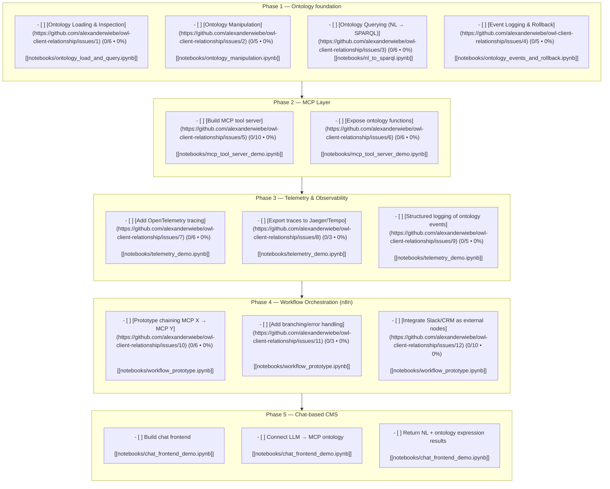

# Overview of project tasks

```mermaid
flowchart TD

    subgraph P1["Phase 1 — Ontology foundation"]
        direction TB
        P1A["- [ ] [Ontology Loading & Inspection](https://github.com/alexanderwiebe/owl-client-relationship/issues/1) (0/6 • 0%)  
        [[notebooks/ontology_load_and_query.ipynb]]"]
        P1B["- [ ] [Ontology Manipulation](https://github.com/alexanderwiebe/owl-client-relationship/issues/2) (0/5 • 0%)  
        [[notebooks/ontology_manipulation.ipynb]]"]
        P1C["- [ ] [Ontology Querying (NL → SPARQL)](https://github.com/alexanderwiebe/owl-client-relationship/issues/3) (0/6 • 0%)  
        [[notebooks/nl_to_sparql.ipynb]]"]
        P1D["- [ ] [Event Logging & Rollback](https://github.com/alexanderwiebe/owl-client-relationship/issues/4) (0/5 • 0%)  
        [[notebooks/ontology_events_and_rollback.ipynb]]"]
    end

    subgraph P2["Phase 2 — MCP Layer"]
        direction TB
        P2A["- [ ] [Build MCP tool server](https://github.com/alexanderwiebe/owl-client-relationship/issues/5) (0/10 • 0%)  
        [[notebooks/mcp_tool_server_demo.ipynb]]"]
        P2B["- [ ] [Expose ontology functions](https://github.com/alexanderwiebe/owl-client-relationship/issues/6) (0/6 • 0%)  
        [[notebooks/mcp_tool_server_demo.ipynb]]"]
    end

    subgraph P3["Phase 3 — Telemetry & Observability"]
        direction TB
        P3A["- [ ] [Add OpenTelemetry tracing](https://github.com/alexanderwiebe/owl-client-relationship/issues/7) (0/6 • 0%)  
        [[notebooks/telemetry_demo.ipynb]]"]
        P3B["- [ ] [Export traces to Jaeger/Tempo](https://github.com/alexanderwiebe/owl-client-relationship/issues/8) (0/3 • 0%)  
        [[notebooks/telemetry_demo.ipynb]]"]
        P3C["- [ ] [Structured logging of ontology events](https://github.com/alexanderwiebe/owl-client-relationship/issues/9) (0/5 • 0%)  
        [[notebooks/telemetry_demo.ipynb]]"]
    end

    subgraph P4["Phase 4 — Workflow Orchestration (n8n)"]
        direction TB
        P4A["- [ ] [Prototype chaining MCP X → MCP Y](https://github.com/alexanderwiebe/owl-client-relationship/issues/10) (0/6 • 0%)  
        [[notebooks/workflow_prototype.ipynb]]"]
        P4B["- [ ] [Add branching/error handling](https://github.com/alexanderwiebe/owl-client-relationship/issues/11) (0/3 • 0%)  
        [[notebooks/workflow_prototype.ipynb]]"]
        P4C["- [ ] [Integrate Slack/CRM as external nodes](https://github.com/alexanderwiebe/owl-client-relationship/issues/12) (0/10 • 0%)  
        [[notebooks/workflow_prototype.ipynb]]"]
    end

    subgraph P5["Phase 5 — Chat-based CMS"]
        direction TB
        P5A["- [ ] Build chat frontend  
        [[notebooks/chat_frontend_demo.ipynb]]"]
        P5B["- [ ] Connect LLM → MCP ontology  
        [[notebooks/chat_frontend_demo.ipynb]]"]
        P5C["- [ ] Return NL + ontology expression results  
        [[notebooks/chat_frontend_demo.ipynb]]"]
    end

    %% Flow connections
    P1 --> P2 --> P3 --> P4 --> P5

    click P1A "https://github.com/alexanderwiebe/owl-client-relationship/issues/1" "Ontology Loading & Inspection"
    click P1B "https://github.com/alexanderwiebe/owl-client-relationship/issues/2" "Ontology Manipulation"
    click P1C "https://github.com/alexanderwiebe/owl-client-relationship/issues/3" "Ontology Querying (NL → SPARQL)"
    click P1D "https://github.com/alexanderwiebe/owl-client-relationship/issues/4" "Event Logging & Rollback"
    click P2A "https://github.com/alexanderwiebe/owl-client-relationship/issues/5" "Build MCP tool server"
    click P2B "https://github.com/alexanderwiebe/owl-client-relationship/issues/6" "Expose ontology functions"
    click P3A "https://github.com/alexanderwiebe/owl-client-relationship/issues/7" "Add OpenTelemetry tracing"
    click P3B "https://github.com/alexanderwiebe/owl-client-relationship/issues/8" "Export traces to Jaeger/Tempo"
    click P3C "https://github.com/alexanderwiebe/owl-client-relationship/issues/9" "Structured logging of ontology events"
    click P4A "https://github.com/alexanderwiebe/owl-client-relationship/issues/10" "Prototype chaining MCP X → MCP Y"
    click P4B "https://github.com/alexanderwiebe/owl-client-relationship/issues/11" "Add branching/error handling"
    click P4C "https://github.com/alexanderwiebe/owl-client-relationship/issues/12" "Integrate Slack/CRM as external nodes"
```
