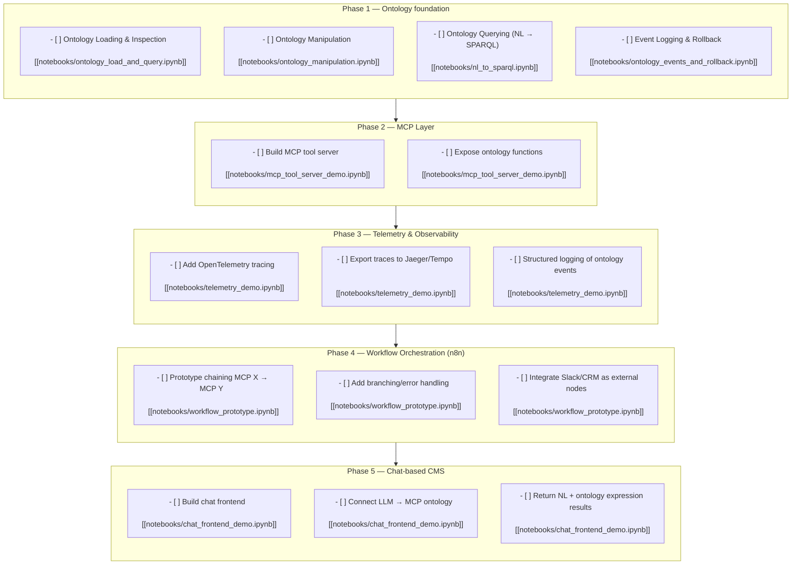

# Overview of project tasks

```mermaid
flowchart TD

    subgraph P1["Phase 1 — Ontology foundation"]
        direction TB
        P1A["- [ ] Ontology Loading & Inspection  
        [[notebooks/ontology_load_and_query.ipynb]]"]
        P1B["- [ ] Ontology Manipulation  
        [[notebooks/ontology_manipulation.ipynb]]"]
        P1C["- [ ] Ontology Querying (NL → SPARQL)  
        [[notebooks/nl_to_sparql.ipynb]]"]
        P1D["- [ ] Event Logging & Rollback  
        [[notebooks/ontology_events_and_rollback.ipynb]]"]
    end

    subgraph P2["Phase 2 — MCP Layer"]
        direction TB
        P2A["- [ ] Build MCP tool server  
        [[notebooks/mcp_tool_server_demo.ipynb]]"]
        P2B["- [ ] Expose ontology functions  
        [[notebooks/mcp_tool_server_demo.ipynb]]"]
    end

    subgraph P3["Phase 3 — Telemetry & Observability"]
        direction TB
        P3A["- [ ] Add OpenTelemetry tracing  
        [[notebooks/telemetry_demo.ipynb]]"]
        P3B["- [ ] Export traces to Jaeger/Tempo  
        [[notebooks/telemetry_demo.ipynb]]"]
        P3C["- [ ] Structured logging of ontology events  
        [[notebooks/telemetry_demo.ipynb]]"]
    end

    subgraph P4["Phase 4 — Workflow Orchestration (n8n)"]
        direction TB
        P4A["- [ ] Prototype chaining MCP X → MCP Y  
        [[notebooks/workflow_prototype.ipynb]]"]
        P4B["- [ ] Add branching/error handling  
        [[notebooks/workflow_prototype.ipynb]]"]
        P4C["- [ ] Integrate Slack/CRM as external nodes  
        [[notebooks/workflow_prototype.ipynb]]"]
    end

    subgraph P5["Phase 5 — Chat-based CMS"]
        direction TB
        P5A["- [ ] Build chat frontend  
        [[notebooks/chat_frontend_demo.ipynb]]"]
        P5B["- [ ] Connect LLM → MCP ontology  
        [[notebooks/chat_frontend_demo.ipynb]]"]
        P5C["- [ ] Return NL + ontology expression results  
        [[notebooks/chat_frontend_demo.ipynb]]"]
    end

    %% Flow connections
    P1 --> P2 --> P3 --> P4 --> P5

```
