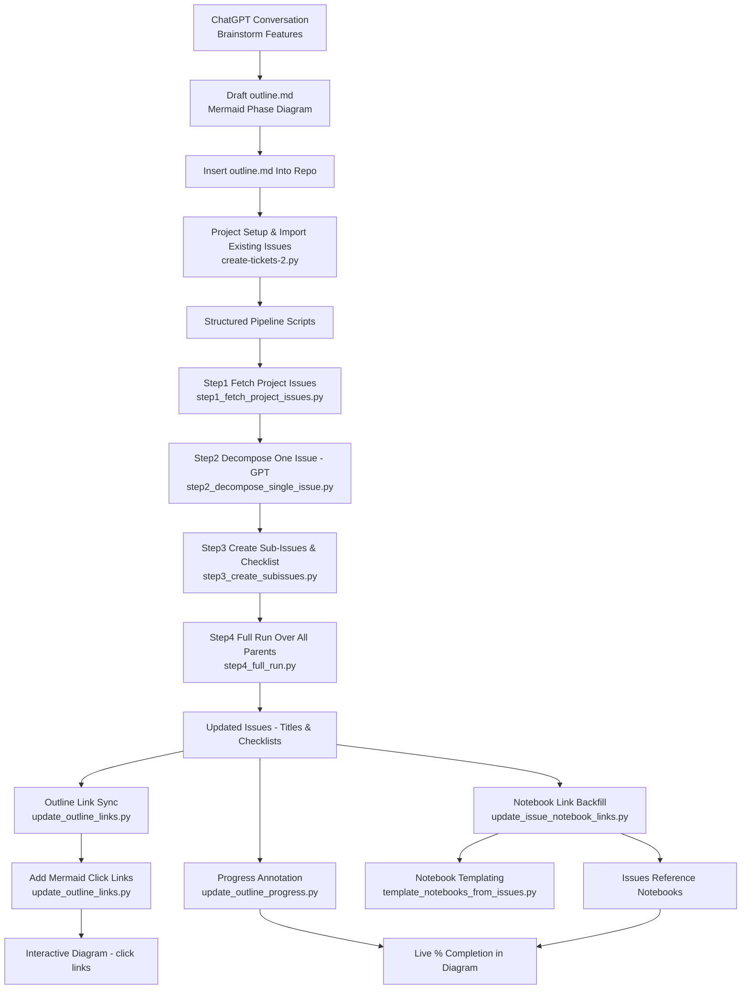

# Story-Building Automation Process

This document summarizes the end-to-end workflow you built to go from an initial ChatGPT conversation → `outline.md` → structured GitHub Project issues → recursive (single-level) task decomposition → synchronized documentation & progress tracking.

## High-Level Flow



## Core Objectives
1. Capture initial product/architecture scope as a visual + checklist (`outline.md`).
2. Materialize each high-level item as a GitHub Issue inside a Project (user project v2).
3. AI-assisted decomposition: break a selected (or all) parent issues into actionable sub-issues safely & idempotently.
4. Maintain two-way traceability:
   - Parent → sub-issue checklist in issue body.
   - Diagram nodes → issue URLs (Mermaid `click` directives).
   - Issues → notebooks (implementation locus) via appended section.
5. Provide rolling progress metrics (closed / total sub-issues) directly inside the visual diagram.

## Repository Scripts Overview

| Script | Purpose | Key Idempotent Mechanism |
| ------ | ------- | ------------------------ |
| `create-tickets-2.py` | Bulk add existing repo issues to the Project | Skips items already in project via node IDs |
| `step1_fetch_project_issues.py` | Read-only export of all project issues (JSON) | Pure read |
| `step2_decompose_single_issue.py` | GPT tasks JSON for one issue (selectable) | Deterministic prompt + optional caching (via Step 4 later) |
| `step3_create_subissues.py` | Create sub-issues + append parent checklist | Title prefix `Story #<parent>` prevents duplicates |
| `step4_full_run.py` | Batch over all parent stories (generation + creation + linking) | Existing titles + checklist parsing + optional cache |
| `update_outline_links.py` | Link diagram titles → issue URLs & insert Mermaid `click` lines | Rewrites click block each run |
| `update_outline_progress.py` | Compute and inject `(closed/total • %)` per node | Regex replace of existing annotation |
| `update_issue_notebook_links.py` | Ensure each issue body references its notebook | Notebook section dedupe by exact path |
| `ai-decompose.py` | Original monolithic prototype (now superseded by steps) | Internal duplicate title checks |

## Environment Variables (Common)

| Variable | Meaning | Typical Value |
| -------- | ------- | ------------- |
| `GITHUB_TOKEN` / `GITHUB_TOKEN_FG` | Auth for GitHub REST/GraphQL | (Personal access token) |
| `OPENAI_API_KEY` | OpenAI Chat completions | (Secret) |
| `USERNAME` | GitHub username | `alexanderwiebe` |
| `PROJECT_NUMBER` | User project v2 number | `1` |
| `DRY_RUN` | When `1`, avoid mutations | `1` or unset |
| `ONLY_ISSUES` | Comma list filter | e.g. `12,14` |
| `CACHE_TASKS` | Step 4: enable task JSON caching | `1` |
| `REGENERATE_TASKS` | Force ignore cache | `1` |
| `MAX_TASKS` | GPT task cap per parent | `12` |

## Typical End-to-End Workflow

### 1. Generate / Maintain Outline
The initial ChatGPT brainstorming yields a hierarchical plan captured in `outline.md` with Mermaid nodes + notebook references.

### 2. (Optional) Seed Project with Existing Issues
Add any pre-existing repo issues to the project:
```
python story-building/create-tickets-2.py
```

### 3. Single-Issue Decomposition (Pilot)
```
python story-building/step1_fetch_project_issues.py \
  | ISSUE_NUMBER=10 python story-building/step2_decompose_single_issue.py \
  | DRY_RUN=1 ISSUE_NUMBER=10 python story-building/step3_create_subissues.py
```
Remove `DRY_RUN=1` once satisfied.

### 4. Batch Decomposition (All Parents)
```
DRY_RUN=1 CACHE_TASKS=1 python story-building/step4_full_run.py
# Inspect stderr summary, then:
CACHE_TASKS=1 python story-building/step4_full_run.py
```
Optional filters:
```
ONLY_ISSUES=5,7 MAX_PARENTS=2 python story-building/step4_full_run.py
```

### 5. Sync Diagram → Issue Links & Click Actions
```
python story-building/update_outline_links.py
```
Re-run anytime after adding new issues or renaming titles.

### 6. Annotate Progress (% Completion)
```
python story-building/update_outline_progress.py
```
Adds / refreshes `(closed/total • %)` tokens next to each node.

### 7. Backfill Notebook Links into Issues
```
python story-building/update_issue_notebook_links.py
```
Injects / extends a `### Notebook` section inside each issue.

### 8. Template / Refresh Notebooks From Issues
```
# Dry-run create missing notebooks for all parents
DRY_RUN=1 python story-building/template_notebooks_from_issues.py

# Overwrite a specific notebook with fresh sub-issue sections & code placeholders
OVERWRITE=1 ONLY_ISSUES=12 INCLUDE_CODE_PLACEHOLDERS=1 python story-building/template_notebooks_from_issues.py
```
Generates a standard notebook header (title, parent link, status) and one section per sub-issue.

### 9. Iterate
As sub-issues are completed, re-run:
```
python story-building/update_outline_progress.py
```
to refresh percentages in the diagram.

## Idempotency Design Notes
* Sub-issue creation guarded by deterministic title pattern: `Story #<parent> – <Task>`
* Parent checklist update adds only missing `- [ ] #<child>` lines.
* Link script rewrites a single consolidated `click` block (no duplicates).
* Progress script replaces existing numeric annotation using a regex.
* Notebook link script creates or extends a single dedicated section and de-dupes exact path lines.
* DRY_RUN across creation scripts allows safe previews.

## Common Troubleshooting
| Symptom | Likely Cause | Remedy |
| ------- | ------------ | ------ |
| 0 tasks generated | GPT prompt truncated or model rate limit | Retry / lower `MAX_TASKS` |
| Duplicate sub-issues | Title edited manually removing `Story #` prefix | Restore prefix or delete dupes & re-run |
| Progress stays 0% | Parent missing checklist section | Re-run Step 3 or manually add `- [ ] #<id>` entries |
| Notebook not linked | Outline notebook path mismatch | Fix filename in `outline.md`, rerun notebook link script |

## Quick Reference Command Cheat Sheet
```
# Pilot a single parent
ISSUE_NUMBER=12 python story-building/step2_decompose_single_issue.py < project_issues.json

# Create sub-issues from prior step tasks (stdin)
ISSUE_NUMBER=12 python story-building/step3_create_subissues.py < tasks.json

# Full batch (with caching)
CACHE_TASKS=1 python story-building/step4_full_run.py

# Refresh links + clicks
python story-building/update_outline_links.py

# Refresh progress
python story-building/update_outline_progress.py

# Backfill notebook links
python story-building/update_issue_notebook_links.py
```

## Extension Ideas
* Add multi-depth decomposition (MAX_DEPTH) with recursive passes.
* Aggregate phase-level completion and inject into subgraph titles.
* Export a static HTML dashboard (Mermaid render + stats table).
* Add label synchronization (e.g., `phase:P1`, `phase:P2`, etc.).

---
This file (`story-building/process.md`) is generated to document your current automation pipeline; maintain it as the process evolves.
